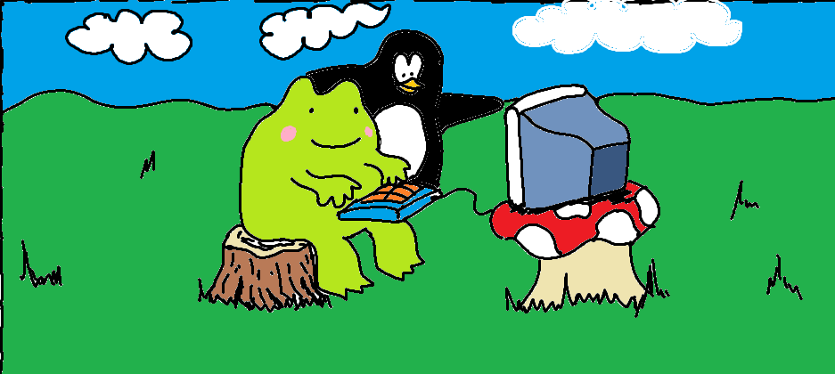

# Getting Started

So you want to start building stuff. on your computer. with code.

You took a few classes. Maybe a bootcamp or two. But you couldn't come up with what to build, or realize your ideas.

