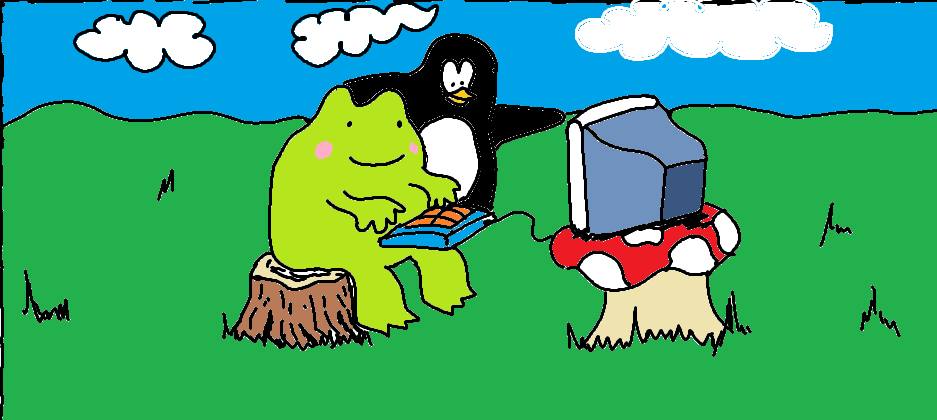

# SIG Hacks Events

Hackathons, Game Jams, and CTFs.
These are the bread and butter of SIG Hacks.

If you're interested in what we have, please refer to the calendar below!

<iframe src="https://calendar.google.com/calendar/embed?src=kc72g1ctfg8b88df34qqb62d1s%40group.calendar.google.com&ctz=America%2FChicago" style="border: 0" width="800" height="600" frameborder="0" scrolling="no"></iframe>

If you want more information on any of these events, continue scrolling down for more!

# Current Events

If this section is empty, it means that there are no upcoming or current events for us to provide information about.

Please refer to the below sections for further information about upcoming major events!

## HackMIT

| Applications | Closed |
| --- | --- |
| **Date** | **September 14-15** |
| --- | --- |

<!-- # Accomplishments -->